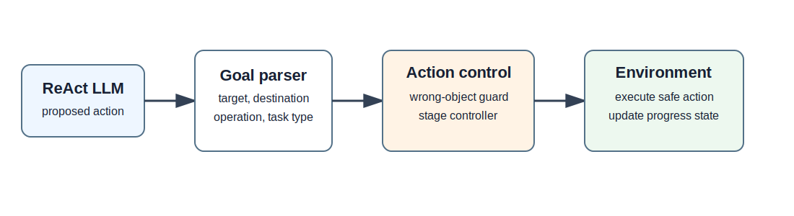

# Guarded-Stage ReAct: Execution-Time Action Control

**Guarded-Stage ReAct** is a lightweight execution-time control layer for ReAct-style language agents in ALFWorld. It sits between the LLM's proposed action and the environment transition, checks whether the action is stage-consistent, and redirects unsafe or unproductive actions when needed.

中文说明见 [README.zh-CN.md](README.zh-CN.md).

## Core Idea

Standard ReAct agents often fail in long-horizon text environments because a locally valid action can be globally wrong:

- taking the wrong object,
- carrying an object to the wrong place,
- undoing progress by taking an already placed object back,
- searching the destination again after the first object has already been placed,
- placing an object before a required heat / cool / clean operation.

Guarded-Stage ReAct keeps the LLM as the main planner, but adds a small controller at execution time:

```text
observation + admissible actions + LLM proposal
        ↓
goal parser + progress state
        ↓
wrong-object guard + stage controller
        ↓
allow / block / redirect
        ↓
environment step
```



## What This Repository Contains

- A reusable Python implementation of the action guard and stage controller.
- A compact ALFWorld-oriented runner skeleton.
- Released result summaries for full valid-unseen evaluation.
- PickTwo debugging examples.
- Editable SVG diagrams for method and failure-mode explanations.
- English and Chinese documentation.

This repository intentionally does **not** include paper PDFs, LaTeX submission folders, or camera-ready manuscript files.

## Main Results

The full valid-unseen evaluation covers **two LLM backbones** on the same 134 ALFWorld tasks with a 25-step execution budget: **Llama-3.1-8B-Instruct** and **Qwen3.5-9B**.

| Backbone | Method | Success | Success rate | Notes |
|---|---|---:|---:|---|
| Llama-3.1-8B | ReAct baseline | 35/134 | 26.1% | Standard ReAct |
| Llama-3.1-8B | Strong Prompt ReAct | 46/134 | 34.3% | Prompt-only stage instructions |
| Llama-3.1-8B | Guarded-Stage ReAct | 77/134 | 57.5% | Execution-time guard + stage controller |
| Qwen3.5-9B | ReAct baseline | 100/134 | 74.6% | Standard ReAct |
| Qwen3.5-9B | Strong Prompt ReAct | 108/134 | 80.6% | Prompt-only stage instructions |
| Qwen3.5-9B | Guarded-Stage ReAct | 110/134 | 82.1% | Execution-time guard + stage controller |

Guarded-Stage ReAct improves ReAct on both backbones: **+31.4 points** on Llama-3.1-8B and **+7.5 points** on Qwen3.5-9B. The largest mechanism-aligned gain appears on PickTwo tasks: Llama ReAct and Strong Prompt solve **0/17**, while Guarded-Stage ReAct solves **13/17**.

Additional released result tables are in `results/`:

- `main_summary.csv`: full-split method comparison for Llama and Qwen.
- `task_type_full134.csv`: task-family success counts.
- `paired_tests_full134.csv`: paired task-level comparisons and McNemar p-values.
- `intervention_stats_full134.csv`: guard, stage-controller, and fallback intervention counts.
- `picktwo_interventions_full134.csv`: PickTwo-specific intervention statistics.
- `ablation_seed42_random50.csv`: seed42 random50 ablation summary.

## Repository Layout

```text
src/guarded_stage_react/   Core action-control implementation
scripts/                   Example runner and result summarization utilities
results/                   Released compact result summaries
examples/                  Small debugging examples
figures/                   Editable SVG diagrams
docs/                      Method and result notes
tests/                     Unit tests for the controller logic
```

## Quick Start

Install the lightweight package:

```bash
pip install -e ".[dev]"
```

Run unit tests:

```bash
pytest -q
```

Use the controller in another ALFWorld runner:

```python
from guarded_stage_react import GuardedStageController

controller = GuardedStageController(goal_text)
safe_action, reason = controller.control(
    proposed_action=llm_action,
    admissible_actions=admissible_actions,
    inventory=inventory,
    observation=observation,
    last_action=last_action,
)
```

The returned `safe_action` can be executed in the environment. `reason` records whether the original action was allowed or redirected by a guard/controller rule.

## Reproduction Notes

- Environment: ALFWorld valid-unseen.
- Main budget: 25 executable steps per task.
- Main controller: wrong-object guard + PickTwo stage controller + fallback ranking.
- The released summaries are compact artifacts. Large raw traces are not committed because they are multi-megabyte logs.

## Citation

If you use this repository, cite the project as:

```bibtex
@software{guarded_stage_react_2026,
  title = {Guarded-Stage ReAct: Execution-Time Action Control for Reliable Language Agents},
  year = {2026},
  url = {https://github.com/QZF-888/guarded-stage-react-execution-control}
}
```
